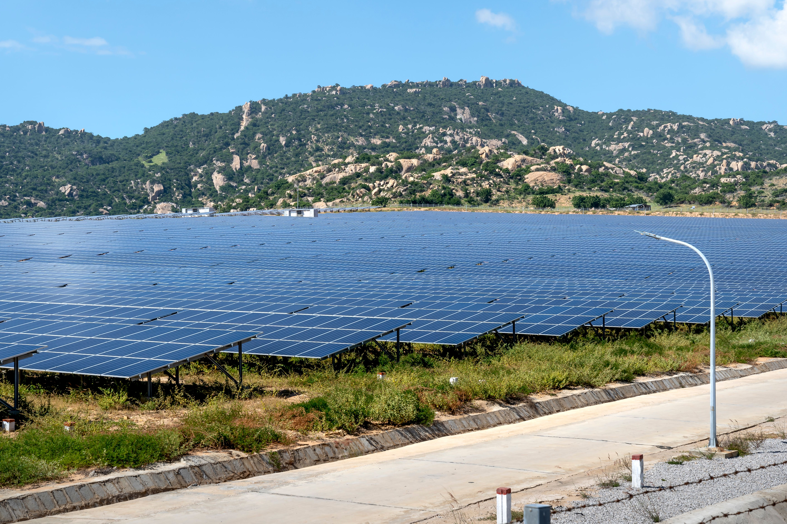

# Smart Matériaux — Site Web

Site vitrine pour **Smart Matériaux**, entreprise solaire basée à Guelmim, spécialisée dans l'installation, le diagnostic et la réparation de systèmes **on-grid**, **off-grid** et de **pompage solaire** pour l'agriculture et l'industrie.

Site statique en HTML / CSS / JS pur — aucune installation, aucun build, prêt pour **GitHub Pages**.

---

## 🚀 Mettre le site en ligne avec GitHub Pages

1. Crée un nouveau dépôt sur GitHub (ex: `smart-materiaux`).
2. Mets tous les fichiers de ce dossier à la racine du dépôt (le fichier `index.html` doit être directement à la racine, pas dans un sous-dossier).
3. Va dans **Settings → Pages** du dépôt.
4. Sous "Source", choisis la branche `main` et le dossier `/ (root)`.
5. Clique sur **Save**. Ton site sera en ligne en 1-2 minutes à une adresse du type :
   `https://ton-nom-utilisateur.github.io/smart-materiaux/`

Tu peux aussi connecter un nom de domaine personnalisé (ex: `smartmateriaux.ma`) dans ce même menu **Settings → Pages → Custom domain**.

---

## 📁 Structure du projet

```
smart-materiaux/
├── index.html              ← page unique (une seule page avec ancres)
├── css/
│   └── styles.css          ← tous les styles (couleurs, mise en page, responsive)
├── js/
│   └── script.js           ← navigation, traduction FR/EN, animations, formulaire
├── assets/
│   ├── logo.png             ← logo complet (avec texte)
│   ├── logo-icon.png         ← logo icône seule (utilisé dans le header/footer)
│   └── favicon-*.png        ← icônes d'onglet navigateur
└── images/
    ├── projects/             ← à remplir avec tes vraies photos de chantiers
    └── products/              ← à remplir avec tes vraies photos de produits
```

---

## ✏️ Personnalisation rapide

### 1. Couleurs
Toutes les couleurs sont centralisées en haut de `css/styles.css`, dans le bloc `:root { ... }`. Change une valeur hexadécimale et tout le site se met à jour automatiquement :
```css
--navy-900: #0A2A43;   /* bleu nuit principal */
--blue-600: #1F77B4;   /* bleu panneau solaire (accent) */
--green-600: #4E8C39;  /* vert feuille (accent éco) */
--amber-500: #E0922F;  /* ambre solaire (boutons d'action) */
```

### 2. Photos de réalisations (section Projets)
La galerie utilise actuellement des vignettes avec icônes en attendant tes vraies photos. Pour les remplacer :
1. Place tes photos dans `images/projects/` (ex: `chantier-1.jpg`)
2. Dans `index.html`, trouve chaque `<div class="project-card">` et remplace le contenu de `<div class="ph-bg">...</div>` par :
   ```html
   
   ```

### 3. Réseaux sociaux
Dans `index.html`, cherche les commentaires `<!-- TODO: replace # with your real social links -->` (section footer) et remplace les `href="#"` par tes vrais liens Facebook / Instagram / LinkedIn.

### 4. Formulaire de contact
Le formulaire fonctionne actuellement via **mailto** : en cliquant sur "Envoyer", le client email du visiteur s'ouvre avec le message pré-rempli (aucun serveur requis, fonctionne directement sur GitHub Pages).

Si tu préfères que les messages soient envoyés automatiquement sans ouvrir de client email, tu peux connecter un service gratuit comme [Formspree](https://formspree.io/) :
1. Crée un compte gratuit sur Formspree et récupère ton URL de formulaire.
2. Dans `index.html`, remplace `<form class="contact-form reveal" id="contactForm">` par :
   ```html
   <form class="contact-form reveal" id="contactForm" action="https://formspree.io/f/TON_ID" method="POST">
   ```
3. Dans `js/script.js`, supprime ou commente la fonction `initForm()` (le `e.preventDefault()` empêcherait l'envoi normal du formulaire).

### 5. Textes en anglais
Tous les textes anglais sont regroupés dans `js/script.js`, dans l'objet `EN = { ... }` en haut du fichier. Le français est directement dans `index.html`. Modifie l'un ou l'autre librement.

---

## 🧩 Notes techniques

- **Bilingue FR/EN** : géré en JavaScript pur (pas de rechargement de page), bouton FR/EN dans le menu.
- **Responsive** : optimisé mobile, tablette, desktop.
- **Animations** : apparitions au scroll, tracé animé façon "circuit imprimé" (clin d'œil au logo), respecte `prefers-reduced-motion`.
- **Carte** : intégration Google Maps sans clé API (iframe simple), pointant vers l'adresse de Guelmim.
- **Aucune dépendance externe** à part Google Fonts (polices) — tout le reste est du code natif.

---

## 📞 Coordonnées intégrées

- **Adresse** : Rue Hassan 2 N° 480, Guelmim 8100, Maroc
- **Téléphone fixe** : +212 5 28 77 44 35
- **WhatsApp** : +212 6 61 39 50 75
- **Email** : sarl.smart01@gmail.com
